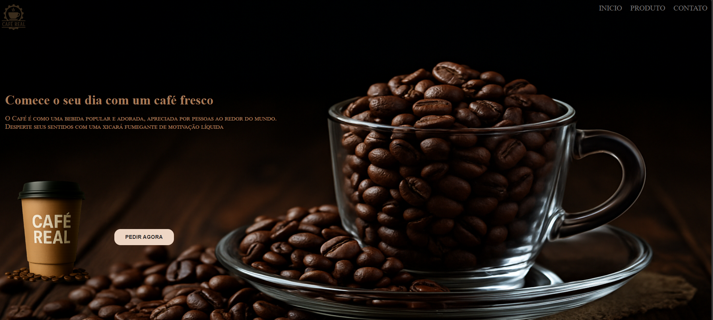

# ☕ Landing Page - CAFE

Bem-vinde ao projeto **Landing Page - CAFE**, uma página simples, bonita e responsiva feita para divulgar uma cafeteria fictícia com estilo e aroma!

## 🌐 Tecnologias utilizadas

- **HTML5**
- **CSS3**
- **@keyframes** para animações suaves
- **Responsividade** para dispositivos móveis e desktops

## 🎯 Objetivo

Esse projeto foi desenvolvido com foco em praticar:
- Estruturação semântica com HTML
- Estilização com CSS puro
- Animações com `@keyframes`
- Técnicas de **responsividade** com media queries

## 💻 Resultado

A página oferece uma experiência visual leve e elegante, com elementos animados e layout adaptável para diferentes tamanhos de tela.

## 📸 Prévia

## 🚀 Como visualizar

https://perdk.github.io/Cafe/

## 📝 Licença

Este projeto foi feito com fins educativos.
Fique à vontade para usar como base e adaptar como quiser!

